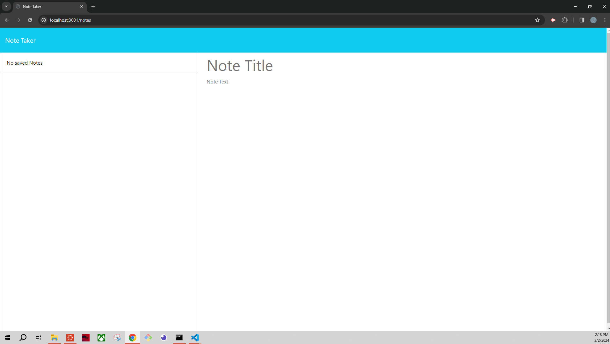
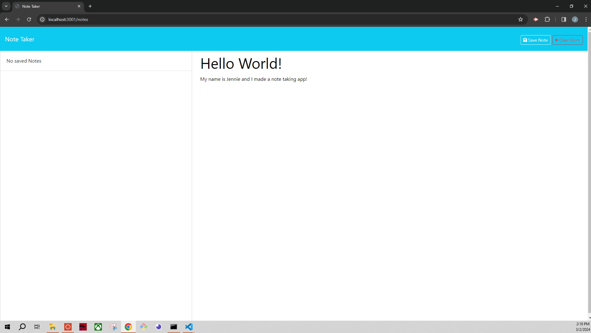
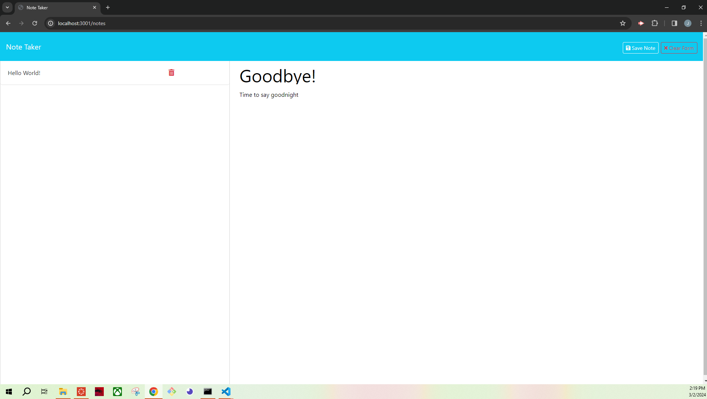
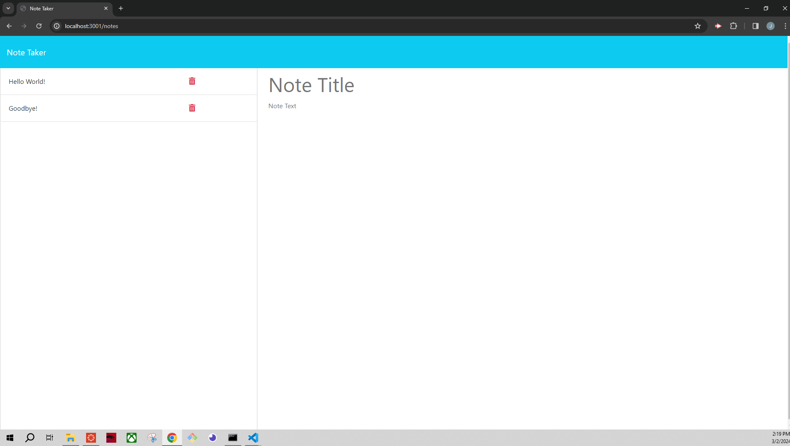

# Note Taker 
  
## Description
This application allows users to input notes or tasks they would like to track by clicking "Get Started" on the landing page. It will direct users to a secondary note.html page that will store old notes, create new notes using a submit button, cancel a current note by using a clear button, and deleted notes saved on the left side of the application by pressing the trash can icon.

## Table of Contents
1. [Installation](#installation)
2. [Usage](#usage)
3. [License](#license)
4. [Contributors](#contributors)
5. [Tests](#tests)
6. [Questions?](#questions)

## Installation
    npm install inquirer@8.2.4

## Usage
Here is a link to my GitHub repository for this application: 
https://github.com/Jbrockhoff/Note-Taker

Here is a link to my deployed application:
https://github.com/Jbrockhoff/Note-Taker

Here is a link to my Heroku repository for this application:  

Here are screenshots of my deployed application:

## License
ISC
Copyright <2024> <Jennie Brockhoff>

Permission to use, copy, modify, and/or distribute this software for any purpose with or without fee is hereby granted, provided that the above copyright notice and this permission notice appear in all copies.

THE SOFTWARE IS PROVIDED “AS IS” AND THE AUTHOR DISCLAIMS ALL WARRANTIES WITH REGARD TO THIS SOFTWARE INCLUDING ALL IMPLIED WARRANTIES OF MERCHANTABILITY AND FITNESS. IN NO EVENT SHALL THE AUTHOR BE LIABLE FOR ANY SPECIAL, DIRECT, INDIRECT, OR CONSEQUENTIAL DAMAGES OR ANY DAMAGES WHATSOEVER RESULTING FROM LOSS OF USE, DATA OR PROFITS, WHETHER IN AN ACTION OF CONTRACT, NEGLIGENCE OR OTHER TORTIOUS ACTION, ARISING OUT OF OR IN CONNECTION WITH THE USE OR PERFORMANCE OF THIS SOFTWARE.

## Contributors
Tutoring assitance from Chris Baird

## Tests
Jest

## Questions?
GitHub Username: Jbrockhoff

Email address: jbrockh1@gmail.com
